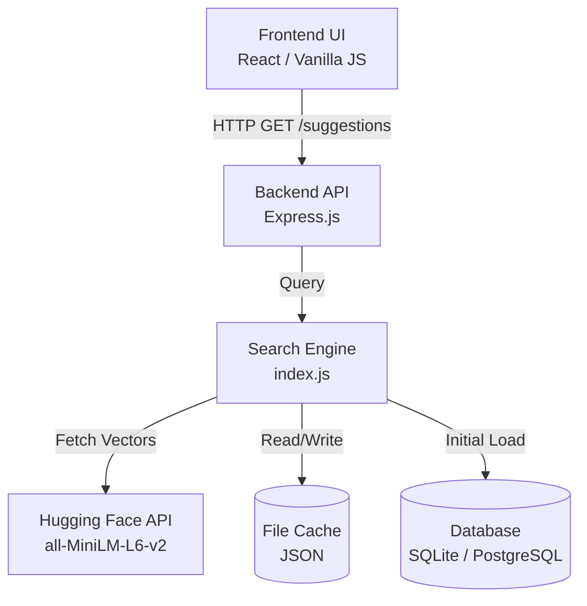
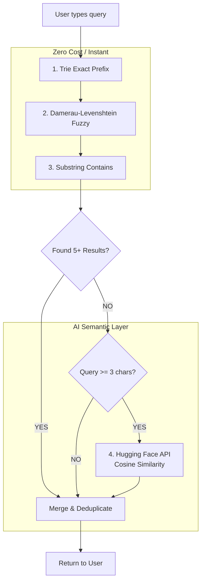
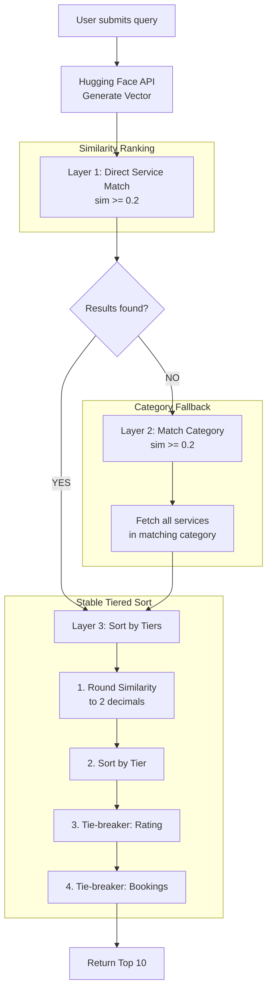

# Bustler Search Plugin Architecture

This document outlines the architecture of the intelligent search plugin, detailing its components, data flow, search pipeline, and caching strategies.

## High-Level Overview

The search plugin is designed as a drop-in, intelligent autocomplete and search engine. It currently operates in a simulated PostgreSQL environment (via SQLite) to prove out the AI reasoning and search logic before full integration into the company's production database.

---

## Core Components

### 1. Frontend (`SearchBar.jsx` & `test.html`)
- **Debouncing**: Input is debounced by 300ms to prevent flooding the backend with partial keystrokes.
- **State Management**: Manages idle state (Trending/History), loading state, autocomplete suggestions, and final search results.
- **Local History**: User's private search history is stored entirely in browser `localStorage`.

### 2. Backend API (`test-server.js`)
An Express server exposing REST endpoints:
- `GET /api/search/suggestions?q=...` : Powers the live autocomplete.
- `GET /api/search/results?q=...` : Executes the final search and ranks results.
- `POST /api/search/record` : Logs a user's search query to update trending stats.
- `GET /api/search/trending` : Retrieves top global searches.
- `POST /api/search/webhook/service-created` : Allows the main company backend to ping the search engine when a new service is created, triggering real-time AI vector generation.

### 3. Search Engine (`index.js`)
The core intelligence module. It loads the database into memory on startup and handles all routing, matching, AI reasoning, and token-saving optimizations.

### 4. Database Layer (`db.js`)
Uses `knex` query builder to abstract the database. Currently configured for SQLite (`test_database.sqlite`), but designed to switch instantly to PostgreSQL by merely updating the connection string.

---

## The 4-Layer Search Pipeline

To provide lightning-fast results while minimizing API costs, autocomplete queries pass through a 4-layer funnel. The system **short-circuits** (stops) early if enough results are found in the cheap layers.

1. **Trie (Prefix)**: `O(length)` exact match for the beginning of titles (e.g., `wed` → `Wedding Photography`).
2. **Fuzzy (Damerau-Levenshtein)**: Tolerates human typos, transpositions, and missing letters (e.g., `fotgraphy` → `Photography`).
3. **Substring**: Catches middle-of-word typing (e.g., `inst` → `CCTV Installation`).
4. **Semantic (AI)**: Understands intent, not just spelling (e.g., `fix my sink` → `Plumbing`). Bypassed if previous layers succeed to save API tokens.

---

## The 3-Layer Final Search Architecture

While autocomplete relies on speed and early short-circuiting, the **final search** (triggered when the user presses Enter) prioritizes deep semantic accuracy and stable ranking using a 3-layer architecture:

1. **Layer 1 (Direct Match)**: Matches the query directly against service vectors. Uses a baseline threshold (`0.2`) to catch anything vaguely similar.
2. **Layer 2 (Category Fallback)**: If no service is a direct hit, the query is matched against the broader category vectors (threshold `0.2`). If a category matches, all services within that category are pulled in as fallback results.
3. **Layer 3 (Tiered Sorting)**: Resolves non-transitive sorting bugs in JavaScript. Similarities are rounded into "tiers" (e.g., `0.45`). Services in the same tier are strictly tie-broken by `Rating`, and then `total_bookings`. This ensures the highest similarity items ALWAYS appear first.

---

## Caching Strategy

The system uses aggressive local caching to bypass the Hugging Face API, saving API tokens and dramatically reducing response times.

| Cache File | Purpose | Lifespan / Update Trigger |
| :--- | :--- | :--- |
| `skill_vectors.json` | Stores the AI 384-dimensional vectors for every category and service in the database. | Written on startup (if missing) and updated via webhook when new services are created. |
| `query_cache.json` | Memorizes the AI vector for user search queries (e.g., "bridal makeup"). | Written immediately when a novel query is processed. Allows instant response for repeated searches. |
| `search_counts.json` | Tracks how many times specific queries are searched to power the "Trending" dropdown. | Written periodically and updated when users execute a final search. |
| `localStorage` | (Browser) Private search history for the individual user. | Maintained locally; never touches the server. |

---

## Production Upgrade Path

When integrating this plugin into the company's live infrastructure, the following architectural shifts are recommended:

> [!TIP]
> **Vector Database Migration**
> Instead of calculating cosine similarity in memory (`index.js`), install the `pgvector` extension in PostgreSQL. This allows the database to handle similarity matching (`ORDER BY vector <-> '[user_query]'`), scaling to 100,000+ services effortlessly.

> [!TIP]
> **Local AI Models**
> Replace the Hugging Face API network calls with `Xenova/transformers.js`. This runs the exact same `MiniLM` model natively on the Node.js server, bringing latency to 0ms and eliminating API rate limits.

> [!TIP]
> **BM25 Keyword Ranking**
> Integrate PostgreSQL's `pg_trgm` to add native BM25 text-ranking to supplement the semantic layer, providing robust handling for reversed-word queries (e.g., "cleaning deep").
